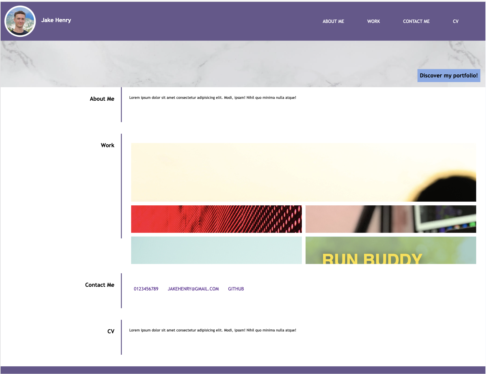
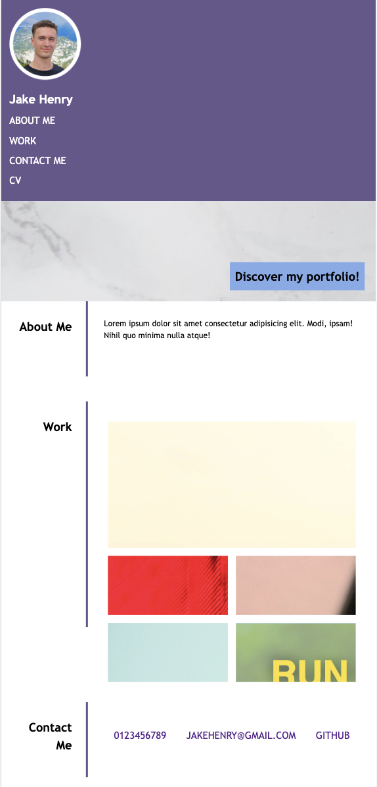

# web-portfolio

## Description

This week's challenge involves building a comprehensive portfolio page that will evolve as I progress through the course. A well-crafted portfolio serves as a powerful tool to showcase my skills and talents, making me an attractive candidate for part-time or full-time positions.

## Table of Contents

- [User Story](#user-story)
- [Acceptance Criteria](#acceptance-criteria)
- [Usage](#usage)
- [Credits](#credits)
- [License](#license)

## User Story

AS A front end web developer
I WANT a portfolio that demonstrates my skills
SO THAT I am an attractive candidate for relevant jobs

## Acceptance Criteria

Here are the critical requirements necessary to develop a portfolio that satisfies a typical hiring manager’s needs:

* When the page is loaded the page presents your name, a recent photo or avatar, and links to sections about you, your work, and how to contact you
* When one of the links in the navigation is clicked then the UI scrolls to the corresponding section
* When viewing the section about your work then the section contains titled images of your applications
* When presented with the your first application then that application's image should be larger in size than the others
* When images of the applications are clicked then the user is taken to that deployed application
* When the page is resized or viewed on various screens and devices then the layout is responsive and adapts to my viewport

## Usage

 

 

## Credits

This project was completed as part of an edX BootCamp coding challenge.

References for semantic HTML elements guidance: 

MDN - https://developer.mozilla.org/en-US/docs/Web/CSS/CSS_grid_layout (help with CSS Grids)

MDN - https://developer.mozilla.org/en-US/docs/Web/CSS/CSS_flexible_box_layout/Basic_concepts_of_flexbox (help with flexbox)

Kevin - https://codepen.io/kevinpowell/pen/GrLKNo (hover effect on Nav bar)

edX module slides - https://bootcampspot.instructure.com/courses/5076/modules

GitHub Pages: https://coding-boot-camp.github.io/full-stack/github/professional-readme-guide (README guidance)

## License

This project is licensed under the MIT License.